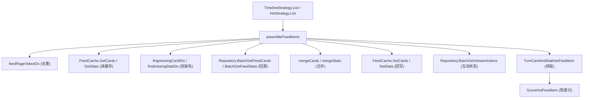
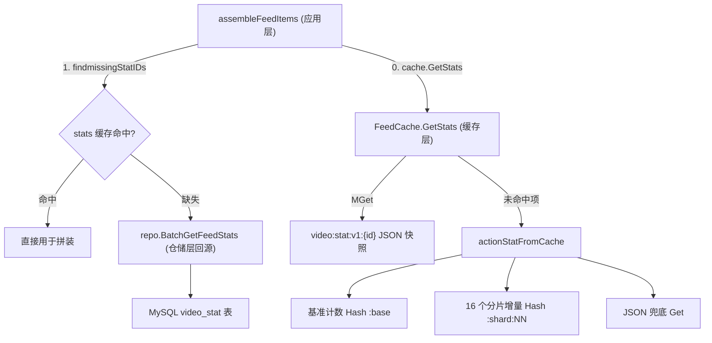

# `assembleFeedItems` 详细说明文档

## 1. 概述

`assembleFeedItems` 是 Feed 应用层的**卡片组装器**，负责把分页查询得到的"轻量骨架数据"（`FeedPageItem`）补全为前端可直接展示的"完整视频卡片"（`FeedItem`）。

它是 Feed 读链路里"**骨架 + 血肉分离**"设计的核心环节：分页查询只返回排序/翻页必需的最小字段，展示字段、计数字段、用户互动状态则分别独立缓存、独立回源，最后在 `assembleFeedItems` 中拼装合并。

- **定义位置**：`apps/api/internal/application/feed/timelineStrategy.go:99`
- **调用方**：
  - `TimelineStrategy.List`（`timelineStrategy.go:53`）
  - `HotStrategy.List`（`hotStrategy.go:57`）

## 2. 函数签名

```go
func assembleFeedItems(
    ctx context.Context,
    repo domainfeed.Repository,
    cache FeedCache,
    pageItems []*domainfeed.FeedPageItem,
    viewerID int64,
) ([]*domainfeed.FeedItem, error)
```

### 参数说明

| 参数 | 类型 | 说明 |
| --- | --- | --- |
| `ctx` | `context.Context` | 请求上下文，贯穿缓存与数据库调用，用于超时/取消控制。 |
| `repo` | `domainfeed.Repository` | 仓储接口，缓存未命中时的回源数据来源。 |
| `cache` | `FeedCache` | 缓存接口，**可为 `nil`**（表示未配置缓存，直接走仓储）。 |
| `pageItems` | `[]*domainfeed.FeedPageItem` | 分页骨架列表，仅含 `VideoID / AuthorID / PublishedAt / HotScore`。 |
| `viewerID` | `int64` | 当前登录用户 ID，`<= 0` 表示匿名（游客），跳过互动状态查询。 |

### 返回值

| 返回 | 说明 |
| --- | --- |
| `[]*domainfeed.FeedItem` | 组装完成的完整卡片列表，顺序与 `pageItems` 一致。 |
| `error` | 仅在**仓储回源失败**时返回错误；缓存读写失败会被降级吞掉（记 Warn 日志）。 |

## 3. 设计背景：为什么要"组装"

Feed 卡片的数据按**变更频率**拆分为三类，分别独立存储与缓存，以最大化缓存命中率、降低回源成本：

| 数据分类 | 领域结构 | 变更频率 | 缓存 TTL | 来源 |
| --- | --- | --- | --- | --- |
| 骨架 / 排序字段 | `FeedPageItem` | 每页请求 | 页缓存 5s（首页）/ 45s | 分页查询 |
| 静态展示字段 | `FeedCard`（标题、封面、作者、媒体 URL 等） | 极低 | `feedCardCacheTTL` = 15 分钟 | `BatchGetFeedCards` |
| 高频计数字段 | `FeedStat`（点赞/评论/收藏数） | 高 | `feedStatCacheTTL` = 15 秒 | `BatchGetFeedStats` |
| 用户互动状态 | `ViewerActionState`（是否点赞/收藏） | 用户相关 | 不缓存 | `BatchGetViewerActions` |

> TTL 常量定义见 `model.go:12-17`。计数字段 TTL 短（15s）保证互动数据相对新鲜，展示字段 TTL 长（15min）因为几乎不变。

## 4. 执行流程详解

### 步骤 0：提取并去重视频 ID

```go
videoIDs := feedPageVideoIDs(pageItems)
if len(videoIDs) == 0 {
    return []*domainfeed.FeedItem{}, nil
}
```

- 调用 `feedPageVideoIDs`（`timelineStrategy.go:206`）遍历骨架列表，**过滤掉 `nil` 与 `VideoID <= 0` 的项，并去重**，保持首次出现顺序。
- 若结果为空，直接返回空切片（非 `nil`），避免后续无意义的缓存/数据库调用。

### 步骤 1：优先从缓存批量读取 Card 与 Stat

```go
cards := map[int64]*domainfeed.FeedCard{}
stats := map[int64]*domainfeed.FeedStat{}
if cache != nil {
    if cacheCards, err := cache.GetCards(ctx, videoIDs); err == nil {
        cards = cacheCards
    } else {
        zap.L().Warn("failed to get feed cards from cache, falling back to repository.", ...)
    }
    // GetStats 同理
}
```

- **缓存为 `nil`** 时跳过，`cards`/`stats` 保持空 map。
- **缓存读取失败**时不返回错误，仅记 Warn 日志并降级——后续逻辑会把缺失项当作"未命中"回源。
- 二次 `nil` 保护：即便缓存返回了 `nil` map，也会被重置为空 map，防止后续写入 `nil` map 触发 panic。

### 步骤 2：补齐缓存缺失的 Card

```go
missingCardIDs := fingmissingCardIDs(videoIDs, cards)
if len(missingCardIDs) > 0 {
    loadedCards, err := repo.BatchGetFeedCards(ctx, missingCardIDs)
    if err != nil {
        return nil, err
    }
    mergeCards(cards, loadedCards)
    if cache != nil {
        _ = cache.SetCards(ctx, loadedCards, feedCardCacheTTL)
    }
}
```

- `fingmissingCardIDs`（`utils.go:148`）找出缓存里没有的 `VideoID`。
- 只对**缺失部分**回源查询（批量），减少数据库压力。
- **回源失败会返回 error**（与缓存失败不同，这是硬错误）。
- `mergeCards`（`utils.go:168`）把回源结果合并进 `cards`，忽略 `nil` 值。
- 回写缓存，**写缓存失败被忽略**（`_ =`），不影响主流程。

### 步骤 3：补齐缓存缺失的 Stat（详解见第 9 节）

```go
missingStatIDs := findmissingStatIDs(videoIDs, stats)
if len(missingStatIDs) > 0 {
    loadedStats, err := repo.BatchGetFeedStats(ctx, missingStatIDs)
    if err != nil {
        return nil, err
    }
    mergeStats(stats, loadedStats)
    if cache != nil {
        _ = cache.SetStats(ctx, loadedStats, feedStatCacheTTL)
    }
}
```

应用层逻辑与步骤 2 对称（`findmissingStatIDs` → `BatchGetFeedStats` → `mergeStats` → `SetStats`，TTL 为 `feedStatCacheTTL` = 15s）。但 Stat 的"补齐"实际横跨**应用层、缓存层、仓储层三层**，且缓存层内部还有一套"基准计数 + 分片增量 + JSON 兜底"的多级回源机制。完整拆解见 [第 9 节：Stat 补齐全链路深度解析](#9-stat-补齐全链路深度解析)。

### 步骤 4：查询当前用户的互动状态

```go
viewerActions := map[int64]*domainfeed.ViewerActionState{}
if viewerID > 0 {
    loaderViewerActions, err := repo.BatchGetViewerActions(ctx, viewerID, videoIDs)
    if err != nil {
        return nil, err
    }
    viewerActions = loaderViewerActions
}
```

- **仅登录用户（`viewerID > 0`）才查询**，游客跳过。
- 该数据与用户强相关，**不做缓存**，直接回源；失败返回 error。

### 步骤 5：逐项拼装为 FeedItem

```go
items := make([]*domainfeed.FeedItem, 0, len(pageItems))
for _, pageItem := range pageItems {
    if pageItem == nil { continue }
    card, ok := cards[pageItem.VideoID]
    if !ok || card == nil { continue }          // 卡片缺失则丢弃该项
    stat := stats[pageItem.VideoID]
    if stat == nil {
        stat = &domainfeed.FeedStat{VideoID: pageItem.VideoID}  // 计数缺失用零值兜底
    }
    publishedAt := pageItem.PublishedAt
    if publishedAt.IsZero() {
        publishedAt = card.PublishedAt           // 骨架无时间则回退到卡片时间
    }
    item := domainfeed.TurnCardAndStatIntoFeedItem(...)  // Card + Stat -> FeedItem
    if action := viewerActions[item.VideoID]; action != nil {
        item.Liked = action.Liked
        item.Favorited = action.Favorited
    }
    item.HotScore = pageItem.HotScore            // 用骨架的 HotScore 覆盖
    items = append(items, item)
}
return items, nil
```

关键处理规则：

1. **遍历原始 `pageItems`（非去重后的 `videoIDs`），保持分页顺序。**
2. **卡片（Card）是硬依赖**：`cards` 中缺失或为 `nil` 的项被直接**跳过丢弃**，不会出现在结果里。
3. **计数（Stat）是软依赖**：缺失时用零值 `&FeedStat{VideoID:...}` 兜底，各项计数显示为 0。
4. **发布时间回退**：骨架 `PublishedAt` 为零值时回退到 `card.PublishedAt`。
5. **互动状态叠加**：仅当 `viewerActions` 中存在对应记录时，覆盖 `Liked`/`Favorited`（默认 false）。
6. **HotScore 覆盖**：`TurnCardAndStatIntoFeedItem` 内部会用 `ScoreHotFeedItem(like,comment,favorite)` 计算一个热度分（`entity.go:129`，公式 `like*3 + comment*5 + favorite*4`），但随后被**骨架里的 `pageItem.HotScore` 覆盖**，以分页排序时使用的分值为准，保证前后一致。

## 5. 依赖关系图



## 6. 错误处理与降级策略

| 场景 | 处理方式 | 是否返回 error |
| --- | --- | --- |
| 缓存读取失败（GetCards/GetStats） | 记 Warn 日志，降级为全部回源 | 否 |
| 缓存回写失败（SetCards/SetStats） | 忽略（`_ =`） | 否 |
| 仓储回源失败（BatchGet*） | 直接向上返回 | **是** |
| 骨架为空 | 返回空切片 | 否 |
| 某项 Card 缺失 | 丢弃该项，不影响其他项 | 否 |
| 某项 Stat 缺失 | 用零值兜底 | 否 |

设计原则：**缓存是加速器不是依赖**（可失败可降级），**仓储是权威数据源**（失败即硬错误）。

## 7. 注意事项与潜在改进点

1. **顺序与数量**：结果顺序严格跟随 `pageItems`；因 Card 缺失被跳过的项会导致返回列表**可能短于**分页 limit，调用方（如 `HasMore`/`NextCursor`）仍以骨架分页信息为准。
2. **N 类数据合并**：Card、Stat、ViewerAction 三类数据通过 `VideoID` 关联，任一环节 map 为 `nil` 已有兜底保护。
3. **命名拼写**：`fingmissingCardIDs` 疑为 `findMissingCardIDs` 的拼写笔误（`find` 写成 `fing`），与 `findmissingStatIDs` 命名风格也不一致，可在后续重构中统一。
4. **HotScore 语义**：`FeedItem.HotScore` 最终取自分页骨架，而非实时计数计算值；理解热榜排序时需注意这一覆盖逻辑。
5. **调用侧完整性**：`HotStrategy.List`（`hotStrategy.go:57`）在调用后**尚未处理 `err` 也未构造返回值**，函数体不完整，需补齐（参考 `TimelineStrategy.List` 的写法：记录错误日志、返回 `ErrLoadFeedFailed`、组装 `FeedResult`）。

## 8. 相关类型速查

- `FeedPageItem`（`entity.go:55`）：`VideoID / AuthorID / PublishedAt / HotScore`
- `FeedCard`（`entity.go:80`）：静态展示字段
- `FeedStat`（`entity.go:94`）：`LikeCount / CommentCount / FavoriteCount`
- `ViewerActionState`（`entity.go:102`）：`Liked / Favorited`
- `FeedItem`（`entity.go:34`）：最终展示卡片
- `Repository`（`repository.go:6`）：仓储接口
- `FeedCache`（`model.go:51`）：缓存接口

## 9. Stat 补齐全链路深度解析

> Stat（互动计数：`LikeCount / CommentCount / FavoriteCount`）是 Feed 卡片里**变更最频繁**的数据，因此它拥有一套比 Card 更复杂的"多级缓存 + 分片计数"补齐策略。本节自顶向下拆解从 `assembleFeedItems` 到 Redis / MySQL 的完整链路。

### 9.1 三层架构总览



关键点：**缓存层的 `GetStats` 与应用层的 `BatchGetFeedStats` 是两条互补的回源路径**——`GetStats` 走 Redis 的实时计数体系，`BatchGetFeedStats` 走 MySQL 的持久化快照。应用层先用前者，仅对前者仍缺失的 ID 才落到后者。

### 9.2 应用层：`assembleFeedItems` 中的 Stat 补齐

对应 `timelineStrategy.go:141-151`：

1. **找缺失**：`findmissingStatIDs(videoIDs, stats)`（`utils.go:158`）遍历去重后的 `videoIDs`，挑出步骤 1 缓存阶段没拿到的 ID。注意此处 `stats` 可能已被 `cache.GetStats` 填充了一部分（含 Redis 实时计数），所以"缺失"只指连 Redis 都没命中的。
2. **回源**：`repo.BatchGetFeedStats(ctx, missingStatIDs)` 查 MySQL。**失败返回 error（硬错误）**。
3. **合并**：`mergeStats(stats, loadedStats)`（`utils.go:176`）把回源结果并入 `stats`，忽略 `nil` 值。
4. **回写**：`cache.SetStats(ctx, loadedStats, feedStatCacheTTL)` 把 MySQL 快照写入 Redis JSON（TTL 15s），**失败被忽略**。

### 9.3 缓存层：`FeedCache.GetStats` 的多级读取

对应 `feedcache.go:92-134`，这是 Stat 补齐最精巧的部分，分两个阶段：

**阶段 A —— 批量读 JSON 快照（`MGet`）**

- 用 `cacheKeys(videoIDs, feedStatKey)` 生成一批 `video:stat:v1:{id}` 键（`cache/utils.go:19`），一次 `MGet` 批量拉取。
- 逐项反序列化 `FeedStat`；若 JSON 里 `VideoID <= 0`，用位置对应的 `videoIDs[index]` 兜底回填。
- `MGet` 整体失败会返回 error（上层降级为全部走仓储）；单项解析失败则跳过（视为未命中）。

**阶段 B —— 对仍未命中的 ID 走实时计数体系（`actionStatFromCache`）**

对阶段 A 没拿到的每个 `videoID`，调用 `actionStatFromCache` → `actionStatWithPresence`（`feedcache.go:136-172`），按以下优先级组合出实时计数：

1. **基准计数 Hash**：`HGetAll` 读 `video:stat:counter:v1:{id}:base`（`interactionStatCounterBaseKey`）。命中则用 `applyActionStatFields` 把 `like_count/comment_count/favorite_count` 字段解析进 `stat`，并标记 `found=true`。
2. **JSON 兜底**：若基准 Hash 为空，退而 `Get` 完整计数 JSON（`actionStatFallback`，`feedcache.go:175`），解析出历史快照值。
3. **16 个分片增量 Hash**：无论前两步是否命中，都调用 `applyActionStatShardDeltas`（`feedcache.go:199`）——通过 pipeline 一次性 `HGetAll` 读取 `video:stat:counter:v1:{id}:shard:00..15`（`interactionStatCounterShardKeys`，分片数 `actionStatCounterShardCount=16`），把各分片的 `like_count/favorite_count` 增量**累加**到基准值上，并用 `clampRedisCount` 保证结果非负。
4. **命中判定**：只有 base / JSON / 任一分片至少一处有数据（`found`）才返回该 stat；否则返回 `false`，交回应用层走 MySQL。
5. **回填快照**：阶段 B 组合成功后，`setActionStatJSON` 把结果写回 `video:stat:v1:{id}`（TTL `actionStatJSONTTL=15s`），加速下次读取。

> **为什么用"基准 + 16 分片"？** 高并发点赞/收藏若都写同一个 Hash 字段会形成热点 key。分片把写压力打散到 16 个 key，读时再聚合求和，是典型的**分片计数器（sharded counter）** anti-hotspot 设计。

### 9.4 仓储层：`BatchGetFeedStats` 的零值兜底

对应 `persistence/feed/gorm.go:85-110`：

```go
// 即使未在数据库中找到统计记录，我们也按 0 处理
for _, videoID := range videoIDs {
    stats[videoID] = &domainfeed.FeedStat{}
}
// 再查 video_stat 表覆盖真实值
```

- **先给所有 ID 预置零值 `FeedStat`**，再查 `video_stat` 表用真实计数覆盖。这样即使某视频从未产生互动（表里无记录），也会返回一个全 0 的 stat，而非缺失——保证拼装阶段不会因 stat 缺失而走零值分支。
- 查询失败返回 error；`videoIDs` 为空时直接返回空 map。

### 9.5 缓存 key 与 TTL 速查

| Key 格式 | 含义 | 生成函数 | TTL |
| --- | --- | --- | --- |
| `video:stat:v1:{id}` | 计数 JSON 快照 | `feedStatKey` | `feedStatCacheTTL` / `actionStatJSONTTL` = 15s |
| `video:stat:counter:v1:{id}:base` | 基准计数 Hash | `interactionStatCounterBaseKey` | 由互动写入侧维护 |
| `video:stat:counter:v1:{id}:shard:NN` | 第 NN 个分片增量 Hash（NN=00..15） | `interactionStatCounterShardKey` | 由互动写入侧维护 |

### 9.6 完整补齐顺序小结

```
1. cache.GetStats
   ├─ MGet video:stat:v1:{id}          (JSON 快照，最快)
   └─ 未命中 → actionStatFromCache
        ├─ HGetAll :base               (基准计数)
        ├─ Get JSON                    (兜底快照)
        ├─ pipeline HGetAll :shard:00-15 (分片增量累加)
        └─ 组合成功 → setActionStatJSON 回填快照
2. findmissingStatIDs                   (仍缺失的 ID)
3. repo.BatchGetFeedStats               (MySQL video_stat，零值兜底)
4. mergeStats                           (合并进 stats)
5. cache.SetStats                       (回写 Redis 快照, TTL 15s)
6. 拼装时 stat==nil 再用零值兜底        (assembleFeedItems 步骤 5)
```

设计原则：**越靠前越快越实时**（Redis 分片计数反映最新互动），**越靠后越权威越持久**（MySQL 是最终真相源），层层兜底确保任意视频都能拿到一个非 nil 的计数。
